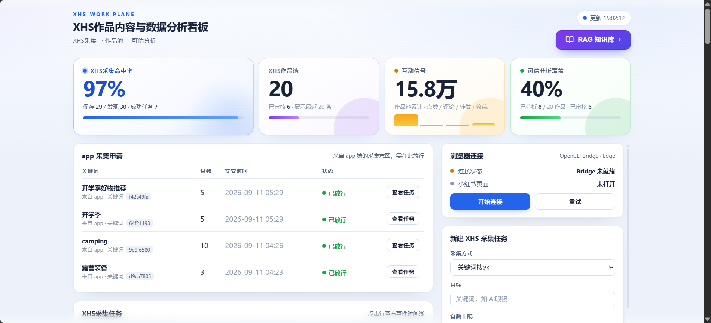
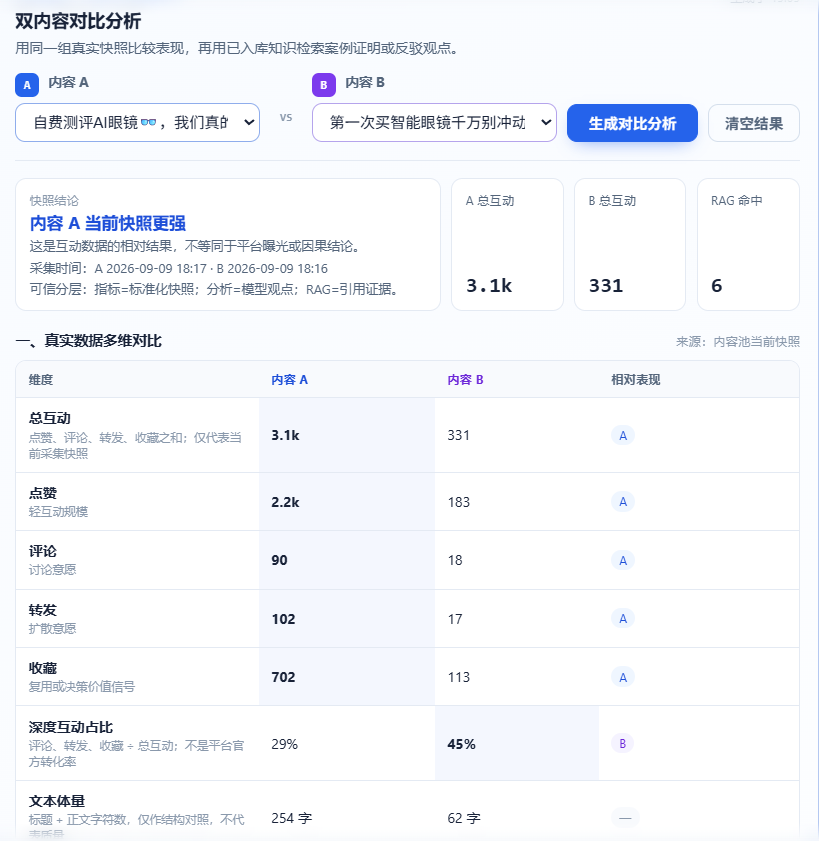
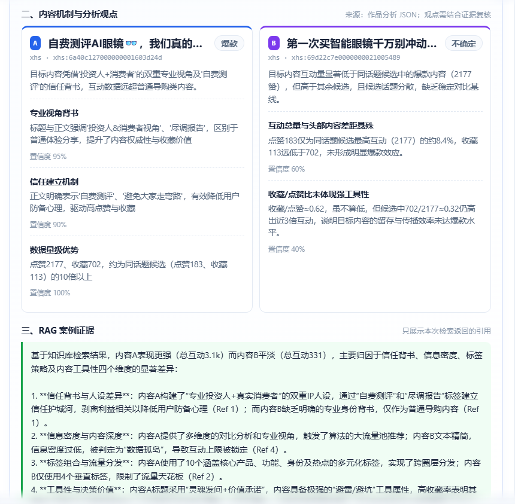
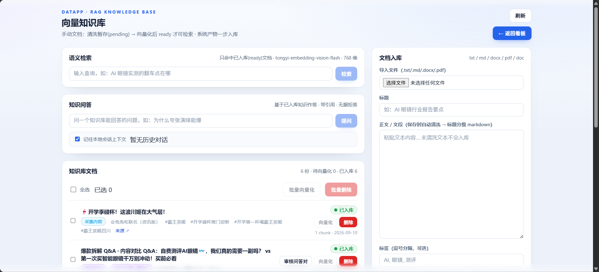
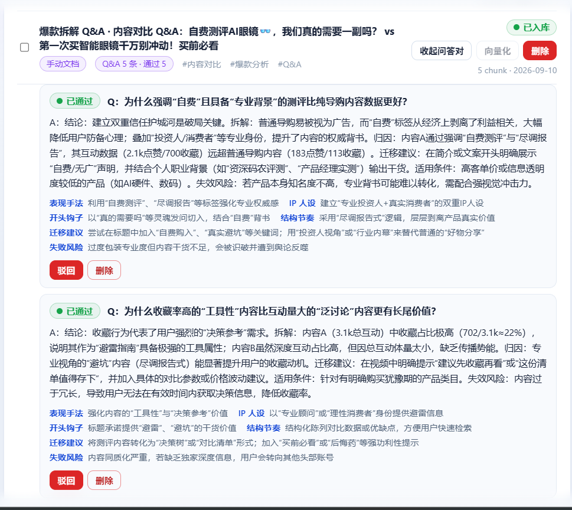
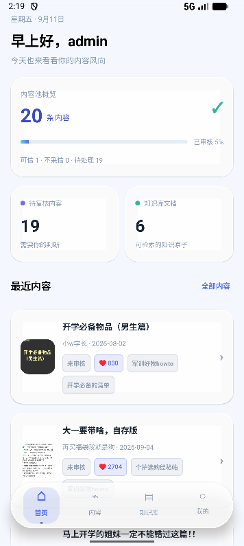
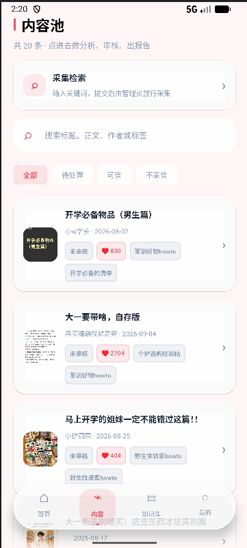
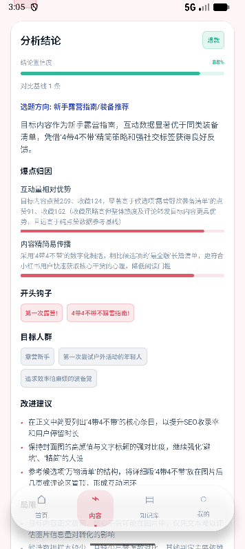
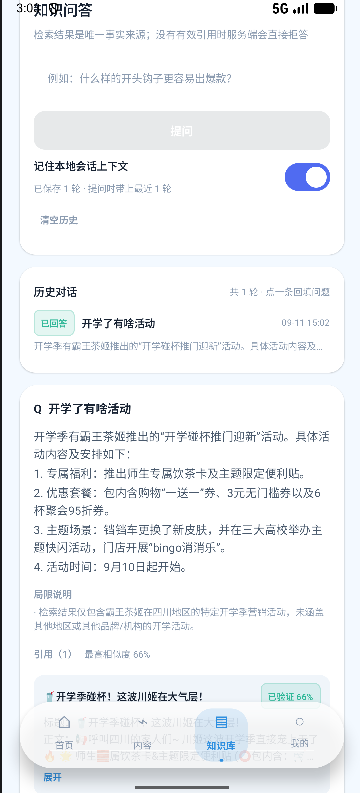

# xhs-work Assistant

小红书等社交平台内容的**采集 → 可信审核 → 结构化分析 → RAG 知识库问答**一体化工作台。
把「刷到爆款后凭感觉复盘」变成一条可追溯、可复核、可问答的数据链路。

## 解决的痛点

| 痛点 | 现状 | 本项目 |
|---|---|---|
| 平台没有给内容策略用的结构化数据 | 手工截图、抄表、按天整理，漏数据且不可复现 | 采集适配器统一落库，字段、时间、来源一次到位 |
| 直接丢给大模型做分析 → 幻觉 | 结论没出处，数字编的，无法回头验证 | 断言级审核 + 证据引用，模型输出 ≠ 事实 |
| 抓取脚本高频、无状态、随时翻车 | 触发风控才发现，失败无记录、无法复现 | 全局并发 1、令牌桶限速、熔断、审计，`run_id` 可重放 |
| 分析产物散在聊天框和表格里 | 换个人、换台机器就找不回，不能检索 | 报告双格式留档 + 知识库向量化，可检索可问答 |
| 未经验证的内容混进知识库 | 问答拿脏数据当依据，错得理直气壮 | 入库门禁 + 检索过滤双层防线，未审内容物理命中不到 |

## 架构

```text
平台内容（小红书图文 / 视频 / 评论）
  -> OpenCLI 采集适配器（复用已登录浏览器会话，绝不绕过风控）
  -> Raw 原始快照落盘（含时间、脱敏来源、版本、SHA-256）
  -> Normalized 标准化 + 去重
  -> 多轮信息源审核（Claim 抽取 -> 本地语料交叉检索 -> 模型判定 -> 人工复核）
  -> Curated 可信内容库
  -> 爆点 / 风格 / 账号人设 / 趋势 结构化报告
  -> RAG 知识库（Q&A 知识原子 + 向量索引）
  -> Agent 带引用问答（无据拒答）
```

三层数据模型 `Raw / Normalized / Curated` 硬隔离；`contents(platform, platform_item_id)` 唯一，媒体按内容哈希去重；互动数据一律是**带采集时间的快照**。

## 三端

| 端 | 目录 | 技术栈 | 职责 |
|---|---|---|---|
| Web 看板 | `client/` | React 18 + TypeScript + Vite | 采集任务、内容池、审核详情、报告、知识库、问答 |
| 后端服务 | `server/` | Python 3.14 + FastAPI + SQLite（规划 PostgreSQL + pgvector） | 采集 / 审核 / 分析 / RAG / Agent |
| Android App | `app/` | Kotlin + Jetpack Compose | 移动端看板（设备令牌免登录，**不含采集模块**） |

采集工具为 [`jackwener/opencli`](https://github.com/jackwener/opencli)（`@jackwener/opencli@1.8.8`，Apache-2.0），本地源码放 `vendor/OpenCLI-1.8.8/`，需自建。

## 界面

> 截图来自本机真库实测，数据是当时采集到的真实内容。

### Web 看板

四个指标一眼看完采集与分析的进度：命中率（保存 29 / 发现 30）、作品池（20 条，已审核 6）、
互动信号累计（15.8 万）、可信分析覆盖（8 / 20）。右侧「app 采集申请」是移动端提交的**采集意图**
—— app 不直接触发采集，要在这里由管理员放行；再往右是 OpenCLI Bridge 的实时连接状态，
Bridge 没就绪就明说「未就绪」，不假装任务在跑。



同话题两条内容摆在一起逐项比：总互动、点赞 / 评论 / 转发 / 收藏、深度互动占比、文本体量。
这一对里 A 赢了六项中的五项，但 B 的**深度互动占比**反而更高（45% vs 29%）。注意结论栏那两行小字：
「是互动数据的相对结果，不等同于平台曝光或因果结论」，以及「可信分层：指标 = 标准化快照 /
分析 = 模型观点 / RAG = 引用证据」—— **哪一层是什么性质，页面上就标什么**。



往下是归因。每条判断挂**置信度**，左右两张卡的结论方向还是相反的 —— 左边 A 判定「爆款」，
三条 95% / 90% / 100%；右边 B 判定「不确定」，两条 60% / 40%。那枚「不确定」chip 是模型自己给的，
不是人工降级。最下面的 RAG 案例证据每条都标 `Ref 1` / `Ref 2`，指向本次检索真正命中的知识原子，
**没有引用就不出结论**。



知识库：检索只命中**已入库（ready）**的文档，问答基于已入库知识作答、带引用、无据拒答。
文档入库支持 txt / md / docx / pdf，正文保存时自动清洗并做标题分级。



一个知识原子的完整样貌：**Q + A + 六维拆解**。六维是 表现手法 / IP 人设 / 开头钩子 / 结构节奏 /
迁移建议 / 失效风险 —— 后两维回答的是「怎么用到自己身上」和「什么情况下这套不成立」。
AI 蒸馏出的问答对默认停在待审，人工点「已通过」才进检索池。



### Android App

**首页与内容池** —— 概览、待复核数、知识库文档数，往下是带封面与互动数的卡片流。
顶部「采集检索」提交的只是**意图**，要回看板由管理员放行；下面按状态筛（全部 / 待处理 / 可信 / 不采信）。

<p align="center">
  
  
</p>

**分析结论与知识问答** —— 先给一个**结论置信度**（这张 88%），再落到选题方向、爆点归因、开头钩子、
目标人群和可执行的改进建议。问答的答案末尾挂着**引用来源与相似度**，以及一段「局限说明」，
写明这次检索覆盖不到的范围。

<p align="center">
  
  
</p>

## 🚀 快速开始与启动指令

### 1. 一键启动双端（推荐，无弹窗打扰）

在项目根目录下，提供了一键静默启动前后端服务的脚本：

- **Windows CMD / 双击直接运行**：
  ```cmd
  start_dev.bat
  ```
- **PowerShell 命令行**：
  ```powershell
  .\start_dev.ps1
  ```
- **PowerShell 无窗口后台静默单行指令**：
  ```powershell
  Start-Process powershell.exe -WindowStyle Hidden -ArgumentList "-Command", "cd F:\datapp\server; uv run uvicorn app.main:app --host 0.0.0.0 --port 8000"; Start-Process powershell.exe -WindowStyle Hidden -ArgumentList "-Command", "cd F:\datapp\client; npm run dev"
  ```

---

### 2. 分端手动启动

#### 后端 FastAPI 服务 (`server/`)
```powershell
cd server
uv sync
uv run uvicorn app.main:app --host 0.0.0.0 --port 8000
```
- 后端 API 地址：`http://127.0.0.1:8000`
- 健康检查：`http://127.0.0.1:8000/health`

#### 前端 Web 看板 (`client/`)
```powershell
cd client
npm install
npm run dev
```
- 看板访问地址：`http://localhost:5173`（会自动代理 `/api` 请求至后端 8000 端口）

#### Android App 编译与安装包构建 (`app/`)

**先建 `local.properties`** —— 它被 `.gitignore` 排除，仓库里没有，须自己创建
（用 Android Studio 打开项目会自动生成 `sdk.dir` 那行）：

```properties
sdk.dir=C\:\\Users\\<你>\\AppData\\Local\\Android\\Sdk
# 必须与服务端 server/.env 的 DATAPP_APP_TOKEN 填同一个值；
# 留空 → 该通道关闭，app 回落登录页（仍可输管理员账号密码）
datapp.appToken=
```

```powershell
# 编译并生成 Debug APK
./gradlew :app:assembleDebug

# 安装到已连接的设备 / 模拟器
adb install -r app/build/outputs/apk/debug/app-debug.apk

# 运行 Android 单元测试与接口连通性测试
./gradlew :app:testDebugUnitTest
```

**后端地址不用改代码重编。** 编进 APK 的 `datapp.baseUrl`（根 `gradle.properties`）只是首次启动的
中性兜底 `http://127.0.0.1:8000`；实际地址在 **app 内改**：「我的」→ 连接 →「修改地址」，
登录页也有入口（*必须有* —— 地址填错时「我的」页根本进不去）。存本机、重启仍生效，
并可「自动探测」在候选列表里找回后端。

最省事的连法是走 adb socket 转发，不碰网络栈，换网 / 防火墙 / 代理都不影响：

```powershell
adb reverse tcp:8000 tcp:8000    # 之后 app 里用 http://127.0.0.1:8000 即可
```

走局域网则填 `http://<电脑局域网IP>:8000`（`ipconfig` 查，DHCP 换网络会变）。

> `10.0.2.2` 是模拟器指向宿主机的标准别名，但**实测本机不通**（超时而非拒绝，本机有 TUN
> 代理网卡）。别把它当稳定选项 —— 它只是自动探测候选列表里的一项，不是默认值。

---

### 3. 回归测试（离线快照，不访问平台）

```powershell
cd server
uv run pytest
```

前置：OpenCLI 已构建、Edge/Chrome 已登录小红书、Browser Bridge 在线。
配置项见 `server/.env.example`；LLM key 未配置时审核 / 报告 / 蒸馏 / 问答返回 503，绝不以假数据兜底。

## 功能

**采集**

- 登录态浏览器会话采集，不伪造 UA / 指纹，不碰验证码与登录墙
- 全局并发 1、每平台独立令牌桶、5–30 秒请求间隔、连续失败熔断进 `blocked`
- 429 / 403 / 验证码 / 300017 / 300031 立即熔断，禁止盲目重试
- 失败任务保留输入、状态与错误分类，用原 `run_id` 重放

**审核**

- 状态机：`supported + 达标 → approved`；冲突并存 → `disputed`；全反证 → `rejected`；证据不足 → `extracted` 待人工
- 判定 `supported / contradicted` 必须挂真实证据；引用候选集之外的 `content_id` 一律丢弃，无证据降级 `unclear`
- 审核批次版本化：重审新增批次、旧批次保留、可切换生效版本

**分析**

- 报告双格式：先出机器可校验 JSON（`§9.1` 结构），再渲染 Markdown
- 输出爆点、内容呈现风格、账号人设假设、风向趋势；每条附样本、指标、证据与**反例**，样本不足直接写「不确定」
- 支持注入补充视角（`focus`），不改判定口径

**RAG 与 Agent**

- 知识原子从 markdown 切片改为「问题 + 答案 + 六维拆解」：`technique` / `persona` / `hook` / `structure` / `transfer` / `transfer_risk`
- 双通道：AI 蒸馏走人工审核闸门；手动录入即终态，无模型 key 也能用
- 拒答三闸：检索为空 / 最高分低于阈值 → 不调用模型直接拒答；有效引用为 0 → 强制拒答并丢弃模型原文
- 红线双层防线：入库门禁（`review_status != approved` → 409）+ 检索侧 SQL JOIN 过滤（越线 chunk 物理命中不到）

**合规**

- 只采集公开或用户明确授权的数据；Cookie / Token / Authorization / 签名参数不进代码、日志、报告
- 含 `xsec_token` 的来源 URL 脱敏保存；日志对个人信息、账号标识、手机号脱敏
- LangChain 仅作编排层，追踪开关写死关闭，防 prompt 与采集内容外发

## 目录结构

```text
xhs-work-assistant/
├─ client/                 # Web 看板（React + TS + Vite）
├─ server/                 # 后端（FastAPI）：采集 / 审核 / 分析 / RAG / Agent
│  ├─ app/adapters/        # OpenCLI / LLM / Embedding 适配器
│  ├─ app/services/        # 采集、标准化、审核、报告、知识库、问答
│  ├─ app/repositories/    # 数据访问（SQLite）
│  ├─ tests/               # 离线快照回归测试，不触真实平台
│  └─ tools/               # 表结构体检、红线基线、端到端验证
├─ app/                    # Android 应用（Kotlin + Compose）
├─ vendor/OpenCLI-1.8.8/   # 采集工具源码（不入库，需自建）
├─ storage/                # 本地原始数据 / 媒体 / 报告
└─ docs/                   # 需求、技术手册、采集可行性报告、对接契约
   └─ screenshots/          # README 界面截图（本机真库实测）
```

## 文档

- [docs/技术手册.md](docs/技术手册.md) —— 架构设计、数据模型、报告规范、RAG 链路、路线图
- [docs/需求.txt](docs/需求.txt) —— 原始需求
- [docs/opencil采集可行性验证报告.md](docs/opencil采集可行性验证报告.md) —— 采集可行性实测证据
- [docs/app端对接契约.md](docs/app端对接契约.md) —— 移动端接口契约与鉴权
- [AGENTS.md](AGENTS.md) —— Agent 边界红线（采集安全 / 凭证 / 数据 / 事实）

## 边界

不绕过风控、验证码、登录或授权范围；不把模型输出当事实写入高可信知识库；不无标记把 `lead` 混入 `verified` 检索；不把第三方平台内容包装成无来源原创事实。
